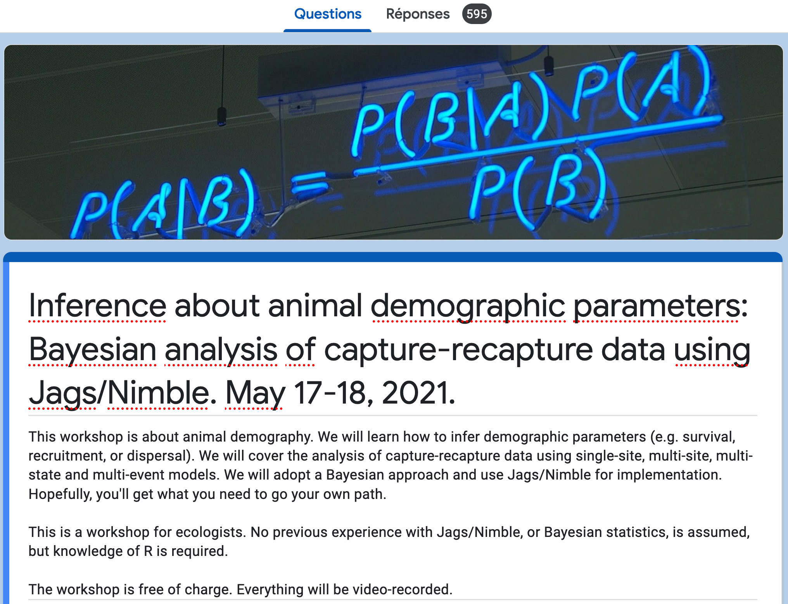

```{r setup, include=FALSE, echo=FALSE}
options(htmltools.dir.version = FALSE)
knitr::opts_chunk$set(comment = "")

library(tidyverse)
theme_set(theme_light())
update_geom_defaults("point", list(size = 2)) 
library(here)
library(nimble)
```


class: center, middle
background-image: url(img/montpellier.png)
background-size: cover

???

+ Welcome to the workshop blabla
+ My name is Olivier Gimenez, I am blabla
+ Wish it was in Montpellier
+ But hey, some advantages, not sure we could have fit 500 people in our meeting room at the lab
+ Before I start, I'd like to show you a few pictures of what you’re missing. This is a bit cruel, I know. 
+ Meeting altogether in Montpellier would have been like a family reunion. 

---
class: center, middle
background-image: url(img/zoom-covid.png)
background-size: cover

???

+ Instead, we're spending quality time on Zoom. 

---
.pull-left[
.title-font[How it all started]

<center><blockquote class="twitter-tweet"><p lang="en" dir="ltr">📢📅🪤 Inference about animal demographic parameters: Bayesian analysis of capture-recapture data using Jags/Nimble. May 17-18, 2021. Remote workshop. Free of charge. Video-recorded. 🥳<br>➡️ Registration is up and running <a href="https://t.co/wB94IWtBKY">https://t.co/wB94IWtBKY</a><br>➡️ Details in the thread. <a href="https://t.co/mP3tuleIkZ">https://t.co/mP3tuleIkZ</a></p>&mdash; Olivier Gimenez 🖖 (@oaggimenez) <a href="https://twitter.com/oaggimenez/status/1355068873746362368?ref_src=twsrc%5Etfw">January 29, 2021</a></blockquote> <script async src="https://platform.twitter.com/widgets.js" charset="utf-8"></script></center>

]

--

.pull-right[
.title-font[Where we're at]

.center[

]

]

???

+ Running workshop for 15 years
+ Daniel Turek in sabbatical who taught us Nimble and convinced us to switch from Jags to Nimble
+ Science should be open
+ A tweet that blew up in my face

---
## What this workshop is about

+ Estimating demographic parameters 
+ Using a class of models called hidden Markov models
+ Within the Bayesian framework

---
## The team 

+ [Chloe Rebecca Nater](https://twitter.com/chloe_nater)

+ [Sarah Cubaynes](https://twitter.com/sarahcubaynes)

+ [Perry de Valpine](https://twitter.com/r_nimble)

+ [Maud Quéroué](https://twitter.com/maudqueroue)    

+ [Olivier Gimenez](https://twitter.com/oaggimenez)


---
## On our plate

### Day 1
+ Crash course on Bayesian statistics and MCMC algorithms
+ Free the modeler in you: Introduction to Nimble
+ What you see is not what you get: Hidden Markov models and capture-recapture
+ Dead or alive: Survival estimation
### Day 2
+ On the move: Transition estimation
+ Known knowns, unknown knowns and unknowns: Uncertainty in state assignment
+ Skip your coffee break: Speed up MCMC convergence 
+ Take-home messages

---
## Philosophy of teaching

+ We've packed lots of things to understand in two days
+ We do not expect you to digest everything in 2 days
+ All material on website <https://oliviergimenez.github.io/bayesian-cr-workshop/>
+ Feel free to play around with material while we walk through it, and afterwards

---
## The way we will interact with each other

+ The workshop is organized in modules, each of which will be a combination of lecture/live demo
+ Everything happens on Zoom
+ Questions and answers via Zoom (or Slack?)


