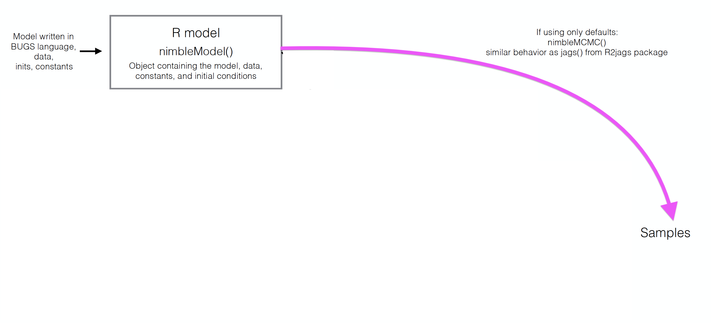
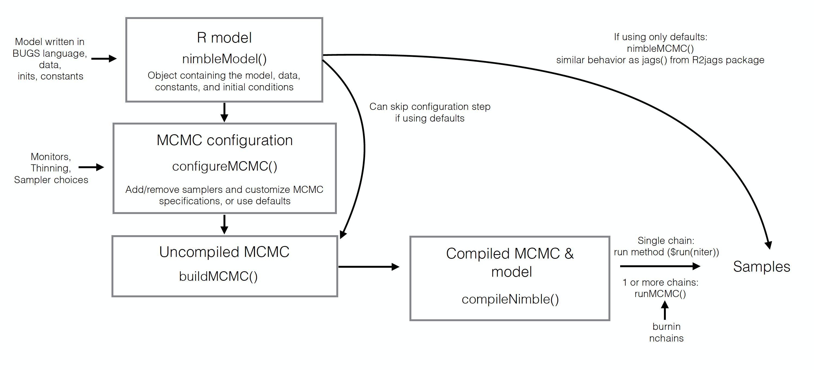

```{r setup, include=FALSE, echo=FALSE, massage = FALSE, warning=FALSE}
options(htmltools.dir.version = FALSE)
knitr::opts_chunk$set(comment = "")

library(tidyverse)
theme_set(theme_light())
update_geom_defaults("point", list(size = 2)) 
library(here)
library(nimble)
```

# What is Nimble?

```{r pressure, echo=FALSE, fig.show='hold',fig.align='center', fig.cap="(Meme created by Todd Arnold's wonderful students)", out.width = c('24%', '60%')}
knitr::include_graphics(c("img/ToddStudents_Meme.jpg","img/RobRob_Comment_edited.png"))
```

---

# What is Nimble?

--

+ **N**umerical **I**nference for statistical **M**odels using **B**ayesian and **L**ikelihood **E**stimation.

--

+ A framework for hierarchical statistical models and algorithms. 

--

+ Uses almost the same model code as WinBUGS, OpenBUGS, and JAGS. 

--

+ An extension of the BUGS language: additional syntax, custom functions and distributions.

--

+ A configurable system for MCMC.

--

+ A library of other methods (SMC, MCEM).

???

+ Sequential Monte Carlo (particle filtering)
+ Monte Carlo Expectation Maximization (maximum likelihood)


--

+ A model-generic programming system to write new analysis methods.


---
## Load `nimble` package

```{r}
library(nimble)
```

---
## Build model, made of likelihood and priors

```{r}
naive.survival.model <- nimbleCode({
  # prior
  phi ~ dunif(0, 1)
  # likelihood
  y ~ dbinom(phi, n)
})
```


---
## Syntax: what's new/better/different?

+ Vectorization
```{r, eval = FALSE}
# JAGS (& Nimble)
for(t in 1:Tmax){
  x[t] <- Mu.x + epsilon[t]
}

# Nimble
x[1:Tmax] <- Mu.x + epsilon[1:Tmax]
```
--

---
## Syntax: what's new/better/different?

+ More flexible specification of distributions
```{r, eval = FALSE}
# JAGS (& Nimble)
for(t in 1:Tmax){
  epsilon[t] ~ dnorm(0, tau)
}
tau <- pow(sigma, -2)
sigma ~ dunif(0, 5)

# Nimble
for(t in 1:Tmax){
  epsilon[t] ~ dnorm(0, sd = sigma)
}
sigma ~ dunif(0, 5)
```

---
## Syntax: what's new/better/different?

+ Your own functions and distributions
```{r, eval = FALSE}
x[1:Tmax] <- myNimbleFunction(a = Mu.x, b = epsilon[1:Tmax])
```

```{r, eval = FALSE}
sigma ~ dCustomDistr(c = 0.5, z = 10)
```

---
## Syntax: what's new/better/different?

+ The end of empty indices
```{r, eval = FALSE}
# JAGS
sum.x <- sum(x[])

# Nimble
sum.x <- sum(x[1:Tmax])
```

--

+ & more...


---
## Read in data

Back to our naive survival model:

```{r}
naive.survival.model <- nimbleCode({
  # prior
  phi ~ dunif(0, 1)
  # likelihood
  y ~ dbinom(phi, n)
})
```

```{r}
my.data <- list(n = 57, y = 19)
```


---
## Distinguish constants and data

To Nimble, not all "data" is data...
```{r}
my.constants <- list(n = 57)
my.data <- list(y = 19)
```

--

**Constants**:
+ Can never be changed 
+ Must be provided when a model is defined (part of the model structure)
+ E.g. vector of known index values, variables used to define for-loops, etc. 

---
## Distinguish constants and data

To Nimble, not all "data" is data...
```{r}
my.constants <- list(n = 57)
my.data <- list(y = 19)
```

**Data**:
+ Can be changed without re-building the model 
+ Can be (re-)simulated within a model
+ E.g. stuff that *only* appears to the left of a "~" 

--

For computational efficiency, better to specify as much as possible as constants.

--

Nimble will help you with this!

---
## Specify initial values

```{r}
initial.values <- function() list(phi = runif(1,0,1))
```

--

```{r}
initial.values()
```


---
## Which parameters to save?

```{r}
parameters.to.save <- c("phi")
```

---
## MCMC details

```{r}
n.iter <- 5000
n.burnin <- 1000
n.chains <- 2
n.thin <- 1
```

--

Number of posterior samples per chain: 

$$n.posterior = \frac{n.iter - n.burnin}{n.thin}$$


---
## Run model, tadaa!

```{r, warning=FALSE, message=FALSE, eval = FALSE}
mcmc.output <- nimbleMCMC(code = naive.survival.model,     
                          data = my.data,  
                          constants = my.constants,
                          inits = initial.values,
                          monitors = parameters.to.save,
                          thin = n.thin,
                          niter = n.iter, 
                          nburnin = n.burnin, 
                          nchains = n.chains)
```

```{r, cache = TRUE, echo = FALSE, warning=FALSE, message=FALSE}
mcmc.output <- nimbleMCMC(code = naive.survival.model,     
                          data = my.data,              
                          constants = my.constants,
                          inits = initial.values,
                          monitors = parameters.to.save,
                          niter = n.iter, 
                          nburnin = n.burnin, 
                          nchains = n.chains,
                          progressBar = FALSE)
```


---
## Explore MCMC outputs

```{r}
str(mcmc.output)
```


---
## Explore MCMC outputs

```{r}
head(mcmc.output$chain1)
```

---
## Explore MCMC outputs

.center.nogap[
```{r, echo = FALSE, fig.width = 7.5, fig.asp = 0.618, dev = "svg", message=FALSE, warning=FALSE}
mcmc.output %>%
  as_tibble() %>%
  janitor::clean_names() %>%
  ggplot() + 
  geom_histogram(aes(x = chain1[,"phi"]), color = "white") + 
  labs(x = "survival probability")
```
]

---
## Numerical summaries

```{r}
library(MCMCvis)
MCMCsummary(mcmc.output, round = 2)
```

---
## Trace and posterior density

.pull-left[

```{r eval = FALSE}
MCMCtrace(mcmc.output,
          pdf = FALSE) 
```
]

--

.pull-right[

.center.nogap[
```{r, echo = FALSE, fig.width = 7.5, fig.asp = 0.618, dev = "svg", message=FALSE, warning=FALSE}
MCMCtrace(mcmc.output,
          pdf = FALSE) 
```
]
]


---
## Trace and posterior density

.pull-left[

```{r eval = FALSE}
MCMCtrace(mcmc.output,
          pdf = FALSE,
          ind = TRUE,
          Rhat = TRUE,
          n.eff = TRUE) 
```
]

--

.pull-right[

.center.nogap[
```{r, echo = FALSE, fig.width = 7.5, fig.asp = 0.618, dev = "svg", message=FALSE, warning=FALSE}
MCMCtrace(mcmc.output,
          pdf = FALSE,
          ind = TRUE,
          Rhat = TRUE,
          n.eff = TRUE) 
```
]
]

---
## Our `nimble` workflow so far




---
## But `nimble` gives full access to the MCMC engine

--



---
class: middle center
background-color: black


---
## Useful resources

+ Official website [https://r-nimble.org](https://r-nimble.org)

+ User Manual [https://r-nimble.org/html_manual/cha-welcome-nimble.html](https://r-nimble.org/html_manual/cha-welcome-nimble.html) and [cheatsheet](https://r-nimble.org/cheatsheets/NimbleCheatSheet.pdf).

+ Users mailing list [https://groups.google.com/forum/#!forum/nimble-users](https://groups.google.com/forum/#!forum/nimble-users)

+ Training material [https://github.com/nimble-training](https://github.com/nimble-training)

+ Reference to cite when using nimble in a publication:

> de Valpine, P., D. Turek, C. J. Paciorek, C. Anderson-Bergman, D. Temple Lang, and R. Bodik (2017). [Programming With Models: Writing Statistical Algorithms for General Model Structures With NIMBLE](https://arxiv.org/pdf/1505.05093.pdf). *Journal of Computational and Graphical Statistics* **26** (2): 403–13.


---
background-color: black
# <span style="color:white">Live demo</span>

<br>
<br>

.center[

]

