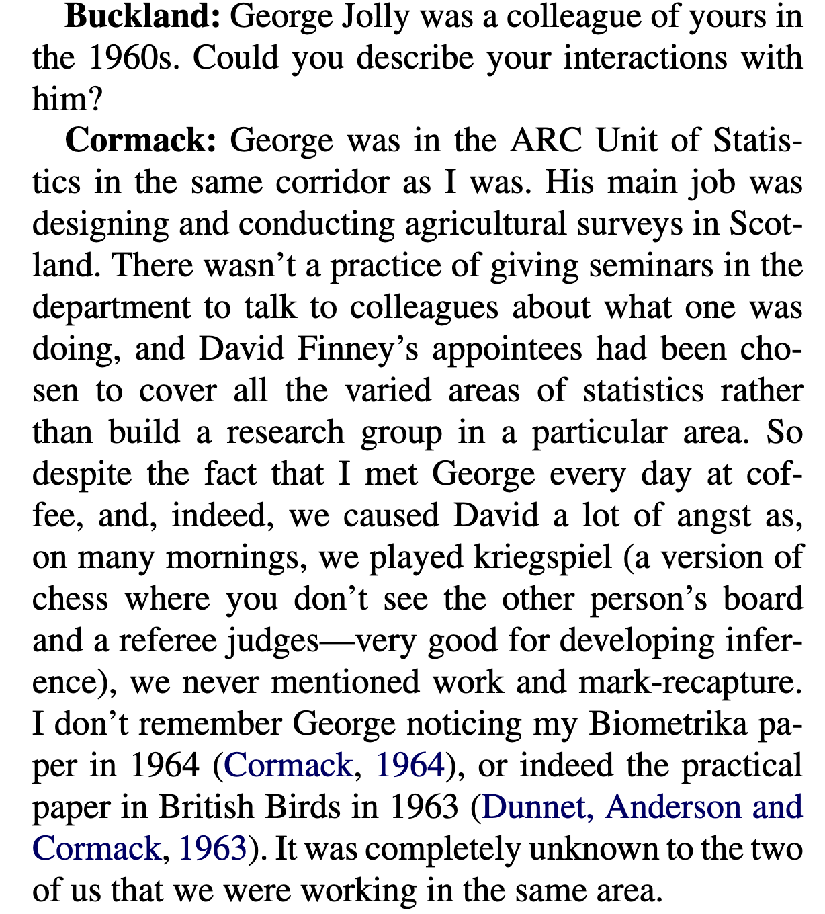
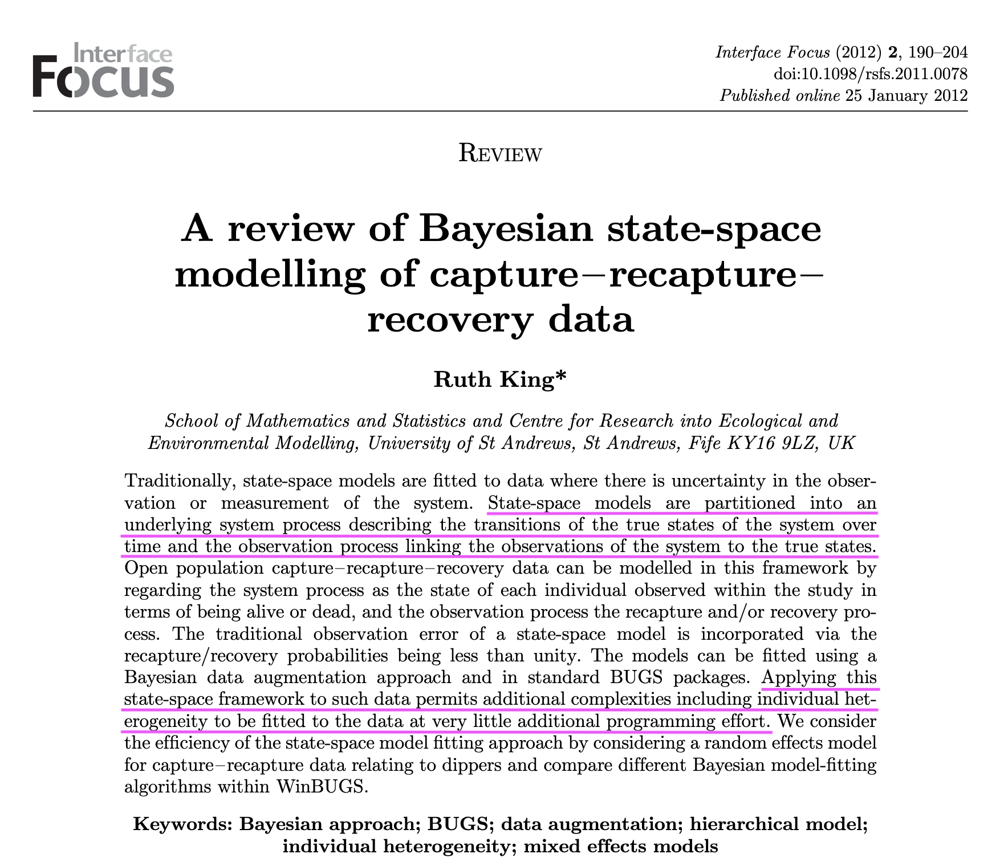

```{r setup, include=FALSE, echo=FALSE}
options(htmltools.dir.version = FALSE)
knitr::opts_chunk$set(comment = "")

library(tidyverse)
theme_set(theme_light())
update_geom_defaults("point", list(size = 2)) 
library(here)
library(nimble)
```


---
### History of the Cormack-Jolly-Seber (CJS) model

--

<font size="5">S.T. Buckland (2016). A Conversation with Richard M. Cormack. Statistical Science 31: 142-150.</font>

--

.pull-left[
```{r, echo=FALSE, out.width="80%"}

```
]

--

.pull-right[
```{r, echo=FALSE, out.width="80%"}
knitr::include_graphics("img/cormack-right.png")
```
]

---

.center[
```{r, echo=FALSE, out.width="70%"}

```
]

??? Bayesian uptake

---
### What we've seen so far 

--

.center.nogap[
```{r, engine = 'tikz', echo = FALSE, fig.width = 7.5, fig.asp = 0.618, dev = "svg"}
\usetikzlibrary{arrows, fit, positioning, automata}
\begin{tikzpicture}[node distance = 2cm]
\tikzset{state/.style = {circle, draw, minimum size = 30pt, scale = 3, line width=1pt}}
\node [state,fill=lightgray!75] (6) [] {$1$};
\node [state,fill=lightgray!75] (5) [left = 20mm of 6] {$1$};
\node [state,fill=lightgray!75] (4) [left = 20mm of 5] {$1$};
\node [state,fill=lightgray!75] (3) [left = 20mm of 4] {$1$};
\node [state,fill=lightgray!75] (7) [right = 20mm of 6] {$2$};
\node [state,fill=lightgray!75] (8) [right = 20mm of 7] {$2$};
\node [state,fill=lightgray!75] (9) [right = 20mm of 8] {$\cdots$};
\node [state,fill=white] (16) [above = 20mm of 6] {$1$};
\node [state,fill=white] (15) [above = 20mm of 5] {$2$};
\node [state,fill=white] (14) [above = 20mm of 4] {$1$};
\node [state,fill=white] (17) [above = 20mm of 7] {$1$};
\node [state,fill=white] (18) [above = 20mm of 8] {$1$};
\draw[->,black, line width=0.25mm,-latex] (3) -- node[above=3mm, align=center] {\huge $\varphi$} (4);
\draw[->,black, line width=0.25mm,-latex] (4) -- node[above=3mm, align=center] {\huge $\varphi$} (5);
\draw[->,black, line width=0.25mm,-latex] (5) -- node[above=3mm, align=center] {\huge $\varphi$} (6);
\draw[->,black, line width=0.25mm,-latex] (6) -- node[above=3mm, align=center] {\huge $1 - \varphi$} (7);
\draw[->,black, line width=0.25mm,-latex] (7) -- node[above=3mm, align=center] {\huge $1$} (8);
\draw[->,black, line width=0.25mm,-latex] (8) -- node[above=3mm, align=center] {\huge $1$} (9);
\draw[->,black, line width=0.25mm,-latex] (4) -- node[left=3mm, align=center] {\huge $1 - p$} (14);
\draw[->,black, line width=0.25mm,-latex] (5) -- node[left=3mm, align=center] {\huge $p$} (15);
\draw[->,black, line width=0.25mm,-latex] (6) -- node[left=3mm, align=center] {\huge $1 - p$} (16);
\draw[->,black, line width=0.25mm,-latex] (7) -- node[left=3mm, align=center] {\huge $1$} (17);
\draw[->,black, line width=0.25mm,-latex] (8) -- node[left=3mm, align=center] {\huge $1$} (18);
\end{tikzpicture}
```
]

+ For states (in gray), $z = 1$ is alive, $z = 2$ is dead.

+ For observations (in white), $y = 1$ is non-detected, $y = 2$ is detected

---
### In the CJS model, survival and recapture are time-varying

--

.center.nogap[
```{r, engine = 'tikz', echo = FALSE, fig.width = 7.5, fig.asp = 0.618, dev = "svg"}
\usetikzlibrary{arrows, fit, positioning, automata}
\begin{tikzpicture}[node distance = 2cm]
\tikzset{state/.style = {circle, draw, minimum size = 30pt, scale = 3, line width=1pt}}
\node [state,fill=lightgray!75] (6) [] {$1$};
\node [state,fill=lightgray!75] (5) [left = 20mm of 6] {$1$};
\node [state,fill=lightgray!75] (4) [left = 20mm of 5] {$1$};
\node [state,fill=lightgray!75] (3) [left = 20mm of 4] {$1$};
\node [state,fill=lightgray!75] (7) [right = 20mm of 6] {$2$};
\node [state,fill=lightgray!75] (8) [right = 20mm of 7] {$2$};
\node [state,fill=lightgray!75] (9) [right = 20mm of 8] {$\cdots$};
\node [state,fill=white] (16) [above = 20mm of 6] {$1$};
\node [state,fill=white] (15) [above = 20mm of 5] {$2$};
\node [state,fill=white] (14) [above = 20mm of 4] {$1$};
\node [state,fill=white] (17) [above = 20mm of 7] {$1$};
\node [state,fill=white] (18) [above = 20mm of 8] {$1$};
\draw[->,black, line width=0.25mm,-latex] (3) -- node[above=3mm, align=center] {\huge $\varphi_1$} (4);
\draw[->,black, line width=0.25mm,-latex] (4) -- node[above=3mm, align=center] {\huge $\varphi_2$} (5);
\draw[->,black, line width=0.25mm,-latex] (5) -- node[above=3mm, align=center] {\huge $\varphi_3$} (6);
\draw[->,black, line width=0.25mm,-latex] (6) -- node[above=3mm, align=center] {\huge $1 - \varphi_4$} (7);
\draw[->,black, line width=0.25mm,-latex] (7) -- node[above=3mm, align=center] {\huge $1$} (8);
\draw[->,black, line width=0.25mm,-latex] (8) -- node[above=3mm, align=center] {\huge $1$} (9);
\draw[->,black, line width=0.25mm,-latex] (4) -- node[left=3mm, align=center] {\huge $1 - p_2$} (14);
\draw[->,black, line width=0.25mm,-latex] (5) -- node[left=3mm, align=center] {\huge $p_3$} (15);
\draw[->,black, line width=0.25mm,-latex] (6) -- node[left=3mm, align=center] {\huge $1 - p_4$} (16);
\draw[->,black, line width=0.25mm,-latex] (7) -- node[left=3mm, align=center] {\huge $1$} (17);
\draw[->,black, line width=0.25mm,-latex] (8) -- node[left=3mm, align=center] {\huge $1$} (18);
\end{tikzpicture}
```
]

+ Survival probability is $\phi_t = \Pr(z_{t+1} = 1 | z_t = 1)$.

+ Recapture (detection) probability is $p_t = \Pr(y_{t} = 1 | z_t = 1)$.

+ Accounts for variation in environmental conditions (survival) or in the sampling effort (detection). 

---
# Model selection

---
## How to select a best model?

+ Is there any effect of rain or temperature or both on breeding success?

+ The proportion of explained variance $R^2$ is problematic, because the more variables you have, the bigger $R^2$ is.

+ Idea: **penalize models with too many parameters**.

---
## Akaike information criterion (AIC)

$$AIC = - 2 \log(L(\hat{\theta}_1,\ldots,\hat{\theta}_K)) + 2 K$$

with $L$ the likelihood and $K$ the number of parameters $\theta_i$.

---
## Akaike information criterion (AIC)

$$\text{AIC} = {\color{red}{- 2 \log(L(\hat{\theta}_1,\ldots,\hat{\theta}_K))}} + 2 K$$

\textcolor{red}{A measure of goodness-of-fit of the model to the data}: the more parameters you have, the smaller the deviance is (or the bigger the likelihood is).

---
## Akaike information criterion (AIC)

$$\text{AIC} = - 2 \log(L(\hat{\theta}_1,\ldots,\hat{\theta}_K)) + {\color{red}{2 K}}$$

\textcolor{red}{A penalty}: twice the number of parameters $K$

---
## Akaike information criterion (AIC)

+ AIC makes the balance between *quality of fit* and *complexity* of a model.

+ Best model is the one with lowest AIC value.

+ Two models are difficult to distinguish if $\Delta \text{AIC} < 2$.

---
## Bayesian version

+ Watanabe-Akaike (Widely-Applicable) Information Criteria or WAIC:

$$\textrm{WAIC} = -2 \sum_{i = 1}^n \log E[\Pr(y_i \mid \theta)] + 
                  2 p_\text{WAIC}$$

+ where $E[p(y_i \mid \theta)]$ is the posterior mean of the likelihood evaluated pointwise at each $i$th observation.

+ $p_\text{WAIC}$ is a penalty computed using the posterior variance of the likelihood. 

+ More in this video <https://www.youtube.com/watch?v=vSjL2Zc-gEQ> by R. McElreath.

---
# Embrace heterogeneity

+ Include individual and temporal covariates (continuous, discrete; sex, age, etc)
+ What about time-varying individual covariates: missing value issue

---
# Missing values

+ What to do w/ missing values (discretization and multistate, fill in NAs Bonner, Langrock)


---
# Unobserved heterogeneity

+ Random effects
+ Mixture here, and later on as an HMM.

---
## Capture-recapture models rely on assumptions

--

+ Design
    + No mark lost
    + Identity of individuals recorded without error (no false positives)
    + Captured individuals are a random sample

--

+ Model
    + Homogeneity of survival and recapture probabilities
    + Independence between individuals (overdispersion)

--

+ Note: Use goodness-of-fit tests to assess assumptions (Pradel et al. 2005) 


---
# GOF

+ Predictive prior/posterior checks bof
+ We have all what we need


---
## Why Bayes? Incorporating information through prior

---
# How to incorporate prior information? 

+ So far, we have assumed a vague prior:

$$\phi_{prior} \sim \text{Beta}(1,1) = \text{Uniform}(0,1)$$

+ How to incorporate prior information?

---
# How to incorporate prior information?

--

+ If no information, mean posterior survival is $\phi_{posterior} = 0.56$ with credible interval $[0.51,0.61]$.

--

+ Using information on body mass and annual survival of 27 European passerines, we can predict survival of European dippers using only body mass.

--

+ For dippers, body mass is 59.8g, therefore $\phi = 0.57$ with $\text{sd} = 0.073$.

--

+ Assuming an informative prior $\phi_{prior} \sim \text{Normal}(0.57,0.073^2)$.

--

+ Mean posterior $\phi_{posterior} = 0.56$ with credible interval $[0.52, 0.60]$.

--

+ No increase of precision in posterior inference.

---
# How to incorporate prior information?

--

+ Now if you had only the three first years of data, what would have happened?

--

+ Width of credible interval is 0.47 (vague prior) vs. 0.30 (informative prior).

--

+ Huge increase of precision in posterior inference ($40\%$ gain)!

+ Compare \textcolor{blue}{vague} vs. \textcolor{red}{informative} prior

<!-- surv~dnorm(0.57,187.6) # Norm(0.57,sd=0.073) ; precision = 1/var = 1/0.073^2 -->

---
# Prior elicitation via moment matching

--

+ Remember the Beta distribution

--

+ Recall that the Beta distribution is a continuous distribution with values between 0 and 1. Useful for modelling survival or detection probabilities. 

--

+ If $X \sim Beta(\alpha,\beta)$, then the first and second moments of $X$ are:

$$\mu = \text{E}(X) = \frac{\alpha}{\alpha + \beta}$$

$$\sigma^2 = \text{Var}(X) = \frac{\alpha\beta}{(\alpha + \beta)^2 (\alpha + \beta + 1)}$$

---
# Moment matching

+ In the capture-recapture example, we know a priori that the mean of the probability we're interested in is $\mu = 0.57$ and its variance is $\sigma^2 = 0.073^2$.

--

+ Parameters $\mu$ and $\sigma^2$ are seen as the moments of a $Beta(\alpha,\beta)$ distribution.

---

+ Now we look for values of $\alpha$ and $\beta$ that match the observed moments of the Beta distribution ($\mu$ and $\sigma^2$).

--

+ We need another set of equations:

$$\alpha = \bigg(\frac{1-\mu}{\sigma^2}- \frac{1}{\mu} \bigg)\mu^2$$

$$\beta = \alpha \bigg(\frac{1}{\mu}-1\bigg)$$

--

+ For our model, that means:

```{r echo = TRUE}
(alpha <- ( (1 - 0.57)/(0.073*0.073) - (1/0.57) )*0.57^2)
(beta <- alpha * ( (1/0.57) - 1))
```

--

+ Now use $\phi_{prior} \sim \text{Beta}(\alpha = 25.6,\beta = 19.3)$ instead of $\phi_{prior} \sim \text{Normal}(0.57,0.073^2)$

---
# Prior predictive checks

---
## Linear regression

--

.pull-left[

Unreasonable prior $\beta \sim N(0, 1000^2)$

```{r echo=1, fig.height=3, fig.width=3, fig.align='left', echo = FALSE}
plot(density(rnorm(1000, 0, 1000)),   
     main="", xlab="Height (m)")
```
]

--

.pull-right[

Reasonable prior $\beta \sim N(2, 0.5^2)$

```{r echo=1, fig.height=3, fig.width=3, fig.align='left', echo = FALSE}
plot(density(rnorm(1000, 2, 0.5)),   
      main="", xlab="Height (m)")
```
]

---
## Logistic regression

--

.pull-left[

Unreasonable
$\text{logit}(\phi) = \beta \sim N(0, 10^2)$

```{r echo=1, fig.height=3, fig.width=3, fig.align='left', echo = FALSE}
plot(density(plogis(rnorm(1000,0,10)), 
from = 0, to = 1), main='', xlab='survival')
```
]

--

.pull-right[

Reasonable 
$\text{logit}(\phi) = \beta \sim N(0, 1.5^2)$

```{r echo=1, fig.height=3, fig.width=3, fig.align='left', echo = FALSE}
plot(density(plogis(rnorm(1000,0,1.5)), 
from = 0, to = 1), main='', xlab='survival')
```
]

---
# Parameter-redundancy issue

+ prior-posterior overlap

---
## What does survival actually mean in capture-recapture ?

--

+ Survival refers to the study area

--

+ Mortality and permanent emigration are confounded

--

+ Therefore we estimate apparent survival, not true survival

--

+ Apparent survival probability = true survival × study area fidelity

--

+ Consequently, apparent survival < true survival unless study area fidelity = 1

--

+ Note: Combine with recoveries (Lebreton et al. 1999), or go spatial (Gilroy et al.
2012, Schaub & Royle 2014)

---
## Further reading

+ Gimenez 2007, 

+ Royle et al. 2008.

+ Lebreton et al. 1992. 

+ King et al. 2012. 
